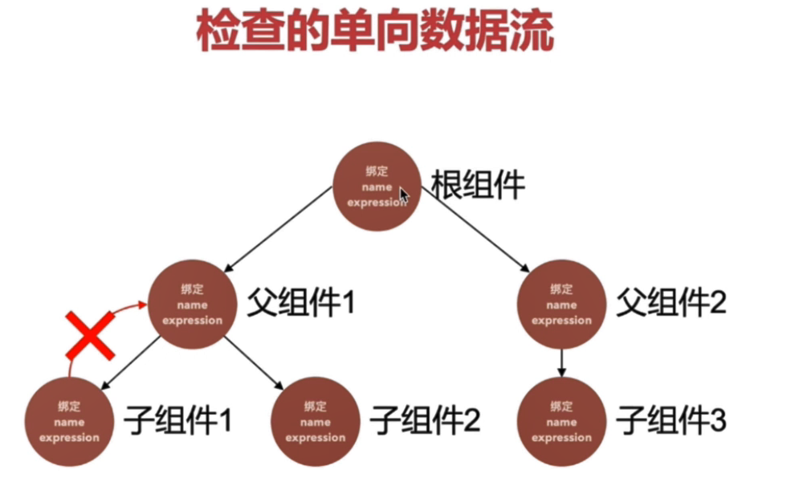

### angularjs 和  angular8 的区别

| angularjs                        | angular8                          |
| -------------------------------- | --------------------------------- |
| 开发语言为js                     | typescript提供类型检查和代码提示  |
| 采用不同的指令进行数据和事件绑定 | 采用[] 进行数据绑定，（）事件绑定 |
| 可扩展性差，在复杂应用上维护性差 | 优异的可扩展性，可维护性          |

### angular，vue，react 的比较

```
angular 是一个完整的框架，react，vue是一个类库（需要寻找各种的开源社区类库）
```

### 安装CLI

```
npm install -g @angular/cli

ng new 项目名

ng new 项目名 --skip-install	//只创建项目，不安装依赖

ng generate component 组件名 		//生成component，class等

ng g m Home --routing 创建带路由的模块

ng serve --host 0.0.0.0

```

### component:


### 指令：

```js
分类：
    组件： 带模板的指令
    结构指令： 改变dom
    属性指令：	属性改变

ng-app	//定义一个 AngularJS 应用程序

ng-controller	@Component//绑定控制器

ng-model  [(ngModel)]//双向绑定

ng-init="name='JOJO'" 	//初始化数据

ng-click	(click)	//单击事件 

ng-repeat	*ngFor	//不允许出现重复元素
		
ng-bind，{{}}	[]//绑定

ng-hide，ng-show		[hidden]	//隐藏
 
ng-class	[ngClass]	//绑定class
 
ng-href 	[href]	//绑定 href
 
ng-if	*ngIf	//条件
 
ng-src	[src]	//绑定src
 
ng-style	[ngStyle]，[style.color]//样式
 
ng-switch	//选择器
	ng-switch-when="true"		*ngSwitchCase="true"
	ng-switch-when="false"		*ngSwitchCase="false"
    ng-switch-default			ngSwitchDefault

ng-content
    
ng-template

ng-container

自定义指令：
1、 引入
	import { Directive } from '@angular/core';
2、 定义
	@Directive({ selector: '[appGrigItem]' })
3、 使用,div 为宿主
	<div appGrigItem></div>


指令的样式和事件绑定：
	//指令没有模板，寄宿在 宿主上
	@HostBinding 绑定宿主的属性或者样式
    @HostBinding('style.display') display = 'grid';
    
	@HostListener 绑定宿主的事件
    @HostListener('click', ['$event.target'])
	handleClick(ev){ console.log(ev) }
 	//组建的样式也可使用 :host 这样一个伪类选择器
	:host{}	//作用于 指令
```

### *ngfor

```js
let item of list, 	// item项
let i = index, 	//数组索引
let first = first; 	//是否第一个元素 boolean
let last = last	// boolean
let odd = odd	//偶数索引 boolean
let  even = even //奇数索引 boolean
trackBy:funcrtion	//使用trackBy的好处是自定义返回跟踪结果，以比对上次的跟踪结果，如果不一样，那么就刷新变化的页面实例（减少不必要的dom刷新而带来性能的提升）。
```

### *ngIf

```js
1、<div *ngIf="条件表达式"> ww </div>

2、<div *ngIf="条件表达式 else elseContent"> ww </div>
	<ng-template #elseContent>ff</ng-template>
	
3、<div *ngIf="条件表达式；then thenTemplate; else elseContent"> </div>
   <ng-template #thenTemplate>ff</ng-template>
   <ng-template #elseContent>ff</ng-template>
```

### 数据绑定

```js
双向数据绑定   [(ngModel)] 
Angular 在每个 JavaScript 事件循环中处理所有的数据绑定，它会从组件树的根部开始，递归处理全部子组件

两者相当：
<input [(ngModel)]="username" />  
<input [ngModel]="username" (ngModelChange)="username = $event"/> 

例：
<appslider [(username)]="username"></appslider>  
<appslider [username]="username" (usernameChange)="username = $event"/></appslider>
```

### 绑定事件：

```js
<a  (click)="s"></a>
```

### 样式绑定的集中方式：

```js
1、<div [class.className]="条件表达式"> ... </div>
	通过表达式绑定 单个class
    
2、<div [ngClass]="{'one'：true，'Two',true}"> ... </div>
	通过对象表达式绑定多个class
   
3、<div [ngStyle]='{"color"：someColor，"font-size",fontsize}'> ... </div>
	通过 style 绑定 样式
```

### 模块（*NgModule*）：

```
解释：
	提供相对独立功能的一组代码(也可以说：是一个小型的应用)

组成：
	模块的组成部分可以有：组件、服务、指令、管道等
	
@NgModule 注解：
declarations： —— 模块拥有的组件、指令、管道。
exports： —— 暴露出去的组件、指令、管道等。
imports： —— 引入没款所需的依赖。
providers： 模块需要的服务
bootstrap：应用的主视图，称为根组件。只有根模块才应该设置这个 bootstrap 属性。


注意：
	模块依赖组件时， 每一个需要的组件都需要导入（例如：formsModule）
	模块依赖服务时， 在 根模块 中导入一次即可(例如： httpClientModule/BrowserAnimationsModule/NoopAnimationsModule)

```

### 注解 / 装饰器：

```
返回函数的函数，typescript 的特性
```

### 组件嵌套：

```
组件嵌套不可避免（过度嵌套会陷入复杂和冗余）
组件的交互（@Input、@Output）
避免组件嵌套导致冗余数据和事件传递
```

### 父 ==》 子

```js
1、父组件传递 值
    <app-header [msg]="msg"></app-header>

2、子组件引入@input模块  
	import { Input } from '@angular/core'

3、子组件中@Input接受父组件传过来的数据   
	@Input() msg:string
```

### 子 ==》 父

```js
1、父组件传递提交方法
	<app-header (tabsubmit)="runParent($event)"></app-header>

2、子组件引入 Output 和 EventEmitter
	import {Output, EventEmitter} '@angular/core'

3、子组件中实例化 EventEmitter
    @Output() private tabsubmit = new EventEmitter<string>();

4、子组件 提交 
    this.tabsubmit.emit('参数')
```

### 投影组件：

```js
ng-content : 动态内容

<ng-content select="样式类/html/指令"></ng-content>	// 使用场景：动态内容，容器组件

例：<ng-content select=".specl"></ng-content>
```

### 生命周期函数：

```css
constructor: 构造函数首先被调用

ngOnChanges：组件的输入属性改变，调用多次

ngOnInit： 初始化数据之后调用，获取不到 具有指令的dom，一般用来请求数据，在第一次ngOnChanges后调用

ngDoCheck:	脏值检测时调用。

ngAfterContentInit:  把内容 投影到组件中调用

ngAfterContentChecked: 每次 投影进组件的内容的变更时 调用（脏值检测）

ngAfterViewInit：组件dom渲染完成

ngAfterViewChecked： 每次做完组件视图和子组件的变更检测之后调用

ngOnDestroy： 在指令、管道或服务被销毁时调用。
```

### 模板在组件类中的引用（@viewChild）

```js
方法一：
1、 定义 # 标识
	<div #helloDiv> hello </div>	
    //# 标识模板或DOM元素的名称
    
2、 通过 @ViewChild 引用模板
    export class AppComponent{ @ViewChild('helloDiv') helloDivRef: ElementRef}
    //@ViewChild 是一个选择器，用来查找要引用的 DOM 元素或者组件
    //ElementRef Dom的包装类,有nativeElement属性

   
方法二（子组件关联）：
1、@ViewChild('imgComponent：子组件名') img:imgComponent;
	//可以通过获取到的 img，来执行子组件的事件
  	this.img.run()


引用多个模板元素(@ViewChildren)：

@ViewChildren('img') imgs: QueryList<ElementRef>
        
        
        
Renderer2：
	// 直接访问 DOM 会导致应用很容易受到在 XSS 攻击。angular推荐render2来访问DOM
1、引入
	import { Renderer2 } from '@angular/core';

2、创建操作的元素
    <div #demo></div>
    <button nz-button (click)="restDemo()">createElement</button>

3、操作DOM
	@ViewChild('demo') demoDom: ElementRef;
    public restDemo(): void {
        const divEle = this.render2.createElement('div');
    	const textEle = this.render2.createText('hello Render2');
    	this.render2.appendChild(divEle, textEle);
    	this.render2.appendChild(this.demoDom.nativeElement, divEle);
    }
```


### 路由(导航，切换视图的机制)：

```tsx
1、配置路由模块
	ng new routing-app --routing	//生成路由模块
	import { AppRoutingModule } from './app-routing.module';	//在app.module中引入
    //配置路由文件，forRoot（根路由）、forChild（子路由）
        @NgModule({
          imports: [RouterModule.forRoot(routes)],
          exports: [RouterModule]
        })


2、配置路由
	①、默认路由设置：
    	{ path: '',   redirectTo: '/first-component', pathMatch: 'full' }
	②、通配符设置：
    	{ path: '**', component:  PageNotFoundComponent }
	③、动态路由匹配
    	{ path: ':order', component: DefaultComponent},


3、跳转路由
	①、 routerLink
        a、queryParams 参数传递
            <a routerLink="/heroes" [queryParams]="{id:1}" routerLinkActive="active">Heroes</a>
        b、动态路由参数传递
            <a routerLink="['/heroes',orderNumber, [queryParams]]" >Heroes</a>


	②、navigate
    	a、无参数
        	this.router.navigate(['login']);
		b、queryParams 传递参数
        	this.router.navigate(['login', 1],{ queryParams: { name: 1 } });
		c、 replace， 阻止路由跳转（设置为false）
			this.router.navigate(['/home'], { replaceUrl: false });
        d、relativeTo，对当前路由跳转（route是ActivatedRoute的实例，）
			this.router.navigate(['login', 1],{relativeTo: route});
		e、preserveQueryParams，保留之前的路由参数（设置为true）
        	this.router.navigate(['home'], { preserveQueryParams: true });
		f、skipLocationChange，保留url不变、传入参数有效（设为true）
			this.router.navigate(['/home'], { skipLocationChange: true });
		g、路由中锚点跳转 /home#top
        	this.router.navigate(['home'],{ fragment: 'top' });
		H、preserveFragment，保留之前路由中的锚点(设为true)
			this.router.navigate(['/role'], { preserveFragment: true });


4、获取参数
	①、引入 ActivatedRoute 模块
    	import { Router, ActivatedRoute, ParamMap } from '@angular/router';
	②、添加到路由页面的构造函数中
        constructor( private route: ActivatedRoute ) {}
	③、 获取 queryParams 参数
    	this.route.queryParams.subscribe(params => { this.name = params['name']; });
    	this.route.queryParamMap.subscribe(params => { this.name = params['name']; });
	④、 获取 paramsAsMap 参数(动态路由)
    	this.route.paramMap.subscribe(params => { this.name = params['name']; });
```

### 路由守卫：

```js
创建服务：
	ng generate guard your-guard

CanActivate：来处理导航到某路由的情况。
CanActivateChild： 来处理导航到某子路由的情况。
CanDeactivate：处理从当前路由离开的情况.
Resolve： 在路由激活之前获取路由数据。可以处理请求提前加载的情况
CanLoad：处理异步导航到某特性模块的情况。
```

### 管道：

```js
作用： 视图中提供格式化值的方法


angular有内置的过滤器，常见的有：
    DatePipe：根据本地环境中的规则格式化日期值。
    UpperCasePipe：把文本全部转换成大写。
    LowerCasePipe ：把文本全部转换成小写。
    CurrencyPipe ：把数字转换成货币字符串，根据本地环境中的规则进行格式化。
    DecimalPipe：把数字转换成带小数点的字符串，根据本地环境中的规则进行格式化。
    PercentPipe ：把数字转换成百分比字符串，根据本地环境中的规则进行格式化。
    JsonPipe： 处理成json数据
    SlicePipe:  消减字符串或数组
    KeyValuePipe: 处理成 keyValue 形式
    
例：
    <td>{{movie.price | currency: 'CNY'}}</td>
    <td>{{data | slice:1:3}}</td>

自定义管道：
	1、引入 Pipe PipeTransform
    	import { Pipe, PipeTransform } from '@angular/core';
    2、定义 Pipe 名
        @Pipe({ name: 'rewardorderState' })
	3、导出管道
    	export class RewardorderStatePipe implements PipeTransform {
          transform(value: string): string { 转换函数体 } }
```

### 依赖注入 和 服务：

```
新建服务：
	1、标记 class 为可注入的服务：@Injectable() 
    2、声明服务： 在模块的 providers 中声明，或使用 import 加载对应模块
	3、组件中使用： 构造函数中直接声明

例：
@Injectable({
  providedIn: 'root'
})
export class LoadInterceptor implements HttpInterceptor {}
```

### 脏值检测：

```
解释：  数据改变时，更新视图（Dom改变）

时机：
	浏览器事件(如click， mouseover，keyup等)
	setTimeout() 和 setInterval()
	Http 请求
	
原理： 检测两个状态值：当前状态和新状态

不推荐在 ngAfterViewChecked 中，修改DOM属性值，因为修改完之后，会立即进行脏值检测，造成死循环，

解决这种情况：使用 ngZone:
	ngAfterViewChecked():void{
	this.ngZone.runOutsideAugular(()=>{
		setInterval(() => {this.title = '修改值'}，100)；
	});
	}
```

#### 脏值流程检测：



#### 脏值流程onpush检测：


RxJS

```js
终端安装npm install rxjs-compat然后声明
import'rxjs / add / operator / map';


Observable：
new Observable((observer) => {
  observer.next()
  //必要。用来处理每个送达值。在开始执行后可能执行零次或多次。
  observer.error()
  //可选。用来处理错误通知。错误会中断这个可观察对象实例的执行过程。
  observer.complete	
  //可选。用来处理执行完毕（complete）通知。当执行完毕后，这些值就会继续传给下一个处理器。
  })

subscribe()	// 订阅，返回一个id，可用于取消订阅
unsubscribe()	//取消订阅


```

网络请求：

```js
app.modules: 引入HttpClientModule
import {HttpClientModule} from '@angular/common/http'

页面引入：
import { HttpClient，httpHeaders } from '@angular/common/http'; 
const   ructor(private http: HttpClient) {
}

const httpOptions = {headers:new HttpHeaders({
	'Content-Type':'application/json'
})}


let res = this.http.request('GET', "api/a",{},httpOptions).subscribe((res) => {
	console.log(res)
});

let res = this.http.post("api/a",{},httpOptions).subscribe((res) => {
	console.log(res)
});
```


```tsx
HttpParams参数写法：

const params =newHttpParams().set("_page","1").set("_limit","10");//方式一：链式语法，set不能分开写

const params =newHttpParams({fromString:"_page=1&_limit=10"});//方式二：使用 fromString

const params =newHttpParams({ fromObject: { _page:"1", _limit:"10"} });//方式三：使用 fromObject
```


Jsonp请求数据

```
在app.module中引入 HttpClientModule,HttpCliemtJsonpModule

this.http.jsonp("api/a",'XXX').subscribe((res) => {}
```

扩展：

```
<div [textContent] = "text"></div>		// 绑定文本

```


